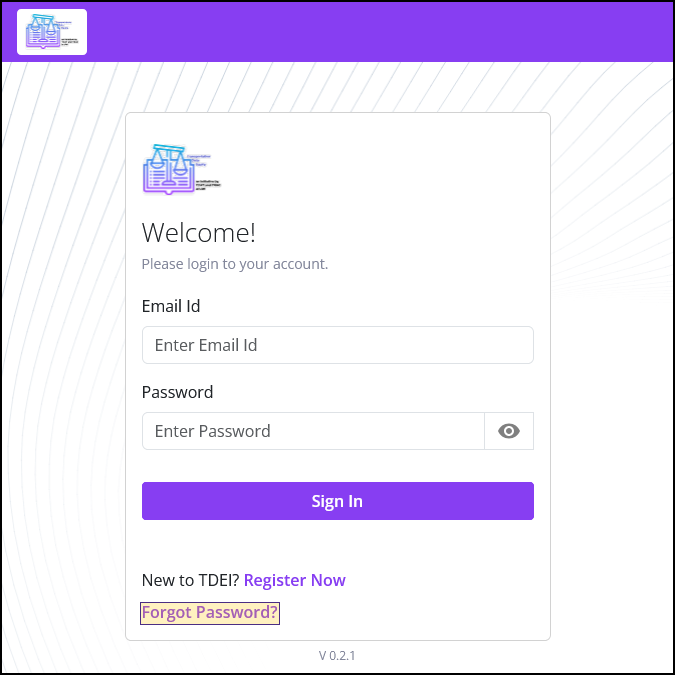

<!-- @format -->

# Contributing

This guide explains how to contribute to the TCAT Wiki.

Note that, while minor external contributions are welcome, this guide is primarily intended for use by TCAT/GS staff.

_For a list of all guides on the TCAT Wiki, refer to the [Guides List](guides-list/index.md)._

---

## Version Control & Workflow

This project follows standardized version control conventions:

### Semantic Versioning

The TCAT Wiki uses [Semantic Versioning](https://semver.org/) (MAJOR.MINOR.PATCH):

-   **Major (X.0.0)**:
    -   Core: New major features or upgrades
    -   Docs: Changes to structure/navigation that break external links
-   **Minor (0.X.0)**:
    -   Core: Significant changes to core features
    -   Docs: New documentation or major reworks
-   **Patch (0.0.X)**:
    -   Core: Minor fixes, fixing typos, completing chores
    -   Docs: Small updates, fixing typos, adding images

The version number is stored in the `version` field in `mkdocs.yml`.

### Conventional Commits

Commits follow [Conventional Commits](https://www.conventionalcommits.org/) with scoping:

-   `feat(scope): description` - Core features or Docs content
-   `fix(scope): description` - Core patches or Docs corrections

Examples:

```
feat(core-plugins): add abbreviations plugin
feat(docs-accessmap): add user manual page
fix(core-util): fix nav generator logic
fix(docs-walksheds): fix typo
```

### Branch Naming

Follow GitHub flow with structured branch names:

**Format**: `type/scope/<work-item-number>-short-description`

**Examples**:

```
feat/core-plugins/1234-add-abbreviations-plugin
feat/docs-accessmap/1024-add-user-manual-page
fix/core-util/9876-fix-nav-generator-logic
fix/docs-walksheds/2048-fix-typo
```

### Pull Request & Release Process

1. Create a feature branch following the naming convention
2. Make commits using conventional commit format
3. Open a pull request to `main`
4. Upon merge to `main`, releases are automated

## Getting Started (Windows 10/11)

This section of the guide explains how to set up a Windows environment for contributing to the TCAT Wiki for the first time.

### Legend

1. Keyboard shortcut to press | Action

    (`Shift`+`C`) | Copy

2. Command to enter into terminal

    [`someCommand --arguments \<path>`]

### Installation and Setup

1. Install [Visual Studio Code](https://code.visualstudio.com/)

    1. Install VS Code Extensions

        1. [EditorConfig for VS Code](https://marketplace.visualstudio.com/items?itemName=EditorConfig.EditorConfig)

        2. [Prettier](https://marketplace.visualstudio.com/items?itemName=esbenp.prettier-vscode)

        3. [Markdown All in One](https://marketplace.visualstudio.com/items?itemName=yzhang.markdown-all-in-one)

        4. [YAML](https://marketplace.visualstudio.com/items?itemName=redhat.vscode-yaml)

        5. [Even Better TOML](https://marketplace.visualstudio.com/items?itemName=tamasfe.even-better-toml)

2. Clone the repository

    ```powershell
    git clone https://github.com/TaskarCenterAtUW/tcat-wiki
    cd tcat-wiki
    ```

3. Install [Python](https://www.python.org/downloads/)

4. Set up Python virtual environment

    1. Create the virtual environment

        ```powershell
        python -m venv .venv
        ```

    2. Activate the virtual environment

        ```powershell
        .\.venv\Scripts\Activate.ps1
        ```

    3. Install dependencies

        ```powershell
        pip install -r requirements.txt
        ```

5. (Optional) Install image processing dependencies for image optimization

    Only needed if you plan to optimize or process images in the documentation.

    1. Install [MSYS2](https://www.msys2.org/)

        1. In UCRT64 terminal:

            1. Install cairo:

                ```powershell
                pacman -S mingw-w64-ucrt-x86_64-cairo
                ```

            2. Install pngquant:

                ```powershell
                pacman -S mingw-w64-ucrt-x86_64-pngquant
                ```

        2. Add to PATH:

            `C:\msys64\ucrt64\bin`

            (Restart your terminal or system for PATH changes to take effect)

## Editing Instructions

Refer to the documentation for [Material for MkDocs](https://squidfunk.github.io/mkdocs-material/) and the [MkDocs User Guide](https://www.mkdocs.org/user-guide/).

### Guide Files

By default, guides appear in both their parent page's guides section and in the main guides list. You can control this using frontmatter flags (YAML comments, invisible on the built page).

To exclude a guide from its parent's guides section:

```yaml
---
title: Your Guide Title
tags:
    - Guide
# exclude-from-parent-guides-list
---
```

To exclude a guide from the main guides list:

```yaml
---
title: Your Guide Title
tags:
    - Guide
# exclude-from-main-guides-list
---
```

Both flags can be used together to exclude a guide from all guides lists.

### Images

Where possible, follow these guidelines for images:

1. Format: 24-bit `.png`

2. Resizing: Scale images using `{ width="123" }`:

    ```markdown
    { width="300" }
    ```

Refer to [Material for MkDocs: Images](https://squidfunk.github.io/mkdocs-material/reference/images/) and [Material for MkDocs: Attribute Lists](https://squidfunk.github.io/mkdocs-material/setup/extensions/python-markdown/#attribute-lists) for more information.

#### Screenshots

For creating screenshots with a consistent style, Firefox DevTools is to be used.

1. Open Firefox DevTools

    (`F12`)

2. Open Responsive Design View

    (`Ctrl`+`Shift`+`M`)

3. Add custom device profiles:

    1. Name: `[Screenshot] Web - Portrait`

        1. Size: `671`x`1196`

        2. Device Pixel Ratio: `1`

        3. User Agent String: `Mozilla/5.0 (Windows NT 10.0; Win64; x64; rv:140.0) Gecko/20100101 Firefox/140.0`

    2. Name: `[Screenshot] Web - Landscape`

        1. Size: `1196`x`671`

        2. Device Pixel Ratio: `1`

        3. User Agent String: `Mozilla/5.0 (Windows NT 10.0; Win64; x64; rv:140.0) Gecko/20100101 Firefox/140.0`

4. Resulting screenshots will fit exactly within the 2px outside border present in the following screenshot templates:

    1. [Screenshot (Landscape)](resources/images/template/screenshot-landscape.png)

    2. [Screenshot (Portrait)](resources/images/template/screenshot-portrait.png)

5. It is recommended to remove all embedded metadata, such as with the use of [ExifToolGUI](https://exiftool.org/gui/).

#### Image Annotations

For creating image annotations with a consistent style, follow these guidelines.

1. Highlight box

    2. Use: Indicating an area of focus in an image.

    3. Style

        1. Padding: `2px` distance from highlighted selection

        2. Outline

            1. Width: `1px`

            2. Color: `#4B2E83` ("Husky "Purple")

        3. Fill

            1. Color: `#FFC700` ("Spirit Gold")

            2. Opacity: `0.25`

    4. Example:

        { loading=lazy }

    5. Naming convention: For images with highlights, append `-h-$highlightedFeature`

        1. Example: `login.png` → `login-h-forgot-password.png`

#### QR Codes

1. Create QR codes using [Project Nayuki's QR Code generator library](https://github.com/nayuki/QR-Code-generator).
