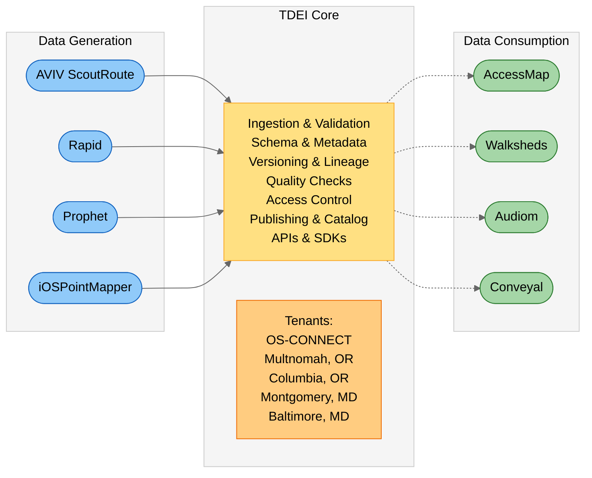

<!-- @format -->

## Welcome to the TCAT Wiki!

This site explains how to use the open-source transportation accessibility **tools** and **data** developed by the [Taskar Center for Accessible Technology](https://tcat.cs.washington.edu/) (TCAT), especially [OS-CONNECT](os-connect/index.md) (Washington State's connected pedestrian network dataset) and the [TDEI](tdei/index.md) (the infrastructure that stores and serves that data).

---

### What's Your Goal?

| If you want to… | Use                                                                                                    |
|-----------------|--------------------------------------------------------------------------------------------------------|
| **View**        | [OS-CONNECT Data Viewer](os-connect/data-viewer/index.md) — a view-only map; no GIS required           |
| **Download**    | [TDEI Portal](tdei/portal/index.md) — manage accounts, API keys, and access controls                   |
| **Plan**        | [Walksheds](walksheds/index.md) for scenario planning, project proposal evaluation, and prioritization |
| **Route**       | [AccessMap](accessmap/index.md) — a public routing app, no portal required                             |

---

### User Journeys (Start Here!)

Choose your path: each one starts with the simplest document and then offers deeper options.

??? abstract "I want to use AccessMap as a resident or advocate"

    Do you want to find accessible, customized pedestrian routing and share it with others?

    **Get Started:** [Use AccessMap](accessmap/user-manual/index.md)

??? abstract "I work for a jurisdiction or agency"

    Do you want to see what pedestrian infrastructure exists for your area, understand what the numbers mean, and decide what to do next?

    **Get Started:** [View the data](os-connect/data-viewer/user-manual/index.md) and get a [Jurisdiction Snapshot (PDF)](os-connect/qa-qc/user-manual/index.md)

??? abstract "I'm a planner / analyst (no GIS required)"

    Do you want to use outputs in planning (ADA transition plans, active transportation plans, equity work)?

    **Get Started:** Reading a dashboard snapshot and following the Planning Playbook. _(Coming soon!)_

??? abstract "I'm a legislator / funder / oversight"

    Do you want to verify what was delivered, see statewide progress, and understand what comes next?

    **Get Started:** Read "What we built" and view the statewide summary. _(Coming soon!)_

??? abstract "I'm a developer / researcher"

    Do you want data downloads, APIs, schemas, and examples?

    **Get Started:** Use the Developer Quickstart Guide _(Coming soon!)_ and review the documentation on the [TDEI](tdei/index.md) and [OSW Schema](opensidewalks/index.md)

??? abstract "I want to help improve the data"

    Do you want to help a jurisdiction validate, report issues, or contribute edits?

    **Get Started:** Learn how to report a problem _(Coming soon!)_ and about how updates happen through [Workspaces](workspaces/index.md)

---

### Key Takeaways

If you remember only three things, remember these:

**[OS-CONNECT](os-connect/index.md) is the dataset** — It is a connected pedestrian network for Washington State (sidewalks, crossings, curb ramps, and related features) in the [OpenSidewalks schema](opensidewalks/schema/index.md), organized so it can be used for routing and analysis.

**[TDEI](tdei/index.md) is the platform** — It is where data can be accessed for downloads and APIs, and where tools like [AccessMap](accessmap/index.md), [Walksheds](walksheds/index.md), [AVIV ScoutRoute](aviv-scoutroute/index.md), and [Workspaces](workspaces/index.md) connect to the data.

**[AccessMap](accessmap/index.md) is the router** — It uses OpenSidewalks Schema-formatted data to provide custom accessible pedestrian routing without requiring specialized tools.

---

### Projects

**[OS-CONNECT](os-connect/index.md)** — Washington State connected pedestrian network dataset.

**[TDEI](tdei/index.md)** — Platform infrastructure for storing, serving, and integrating transportation accessibility data.

**[OpenSidewalks](opensidewalks/index.md)** — The data standard/schema used to represent pedestrian networks as a connected graph.

**[Workspaces](workspaces/index.md)** — Tools for creating and maintaining OSW datasets (via editors like [Rapid](rapid/index.md) and [AVIV ScoutRoute](aviv-scoutroute/index.md)).

**[AccessMap](accessmap/index.md)** — Accessible multimodal routing and trip planning.

**[Walksheds](walksheds/index.md)** — Analysis of access to destinations using the pedestrian network.

**[AVIV ScoutRoute](aviv-scoutroute/index.md)** — Mobile app for adding data into the existing pedestrian map. AVIV ScoutRoute enables everyone to make structured, clear, and direct contributions of surveyed data to enhance it or keep it up to date.

_Additional TCAT projects are listed on the [TCAT website](https://tcat.cs.washington.edu/current-projects/)._

#### Architecture

A multi‑tenant data sharing and exchange platform that supports the full lifecycle of transportation datasets, from collection and updates to publication and consumption.

---

### Quick Concepts

New to this? If you are unfamiliar with some of this terminology, start with these short explanations to learn the concepts in less than 5 minutes:

??? question "Points of Interest (POIs)"

    A **point of interest** (POI) is a specific, identifiable location that is relevant to pedestrians or travelers, such as a transit stop, park entrance, business, public facility, or other amenity. In the context of TCAT projects, POIs are used alongside pedestrian network data to analyze access to destinations and services.

??? question "Connected Networks"

    A **connected network** is a graph of pedestrian infrastructure — sidewalks, crossings, curb ramps, and other paths — where all elements are linked as Nodes, Edges, and Zones forming a complete, traversable network. This is in contrast to disconnected or partial datasets where features exist in isolation.

    **Why this matters:**

    - **Routing** — A connected network enables turn-by-turn pedestrian navigation and accessibility-focused trip planning (as in [AccessMap](accessmap/index.md)), because every path segment connects to the next.
    - **Analysis** — Connectivity allows for network-level analyses (such as [walksheds](walksheds/index.md)), enabling gap detection and equity assessments — computations that require understanding how infrastructure elements relate to one another.

??? question "Walksheds"

    A **walkshed** is the area reachable via a specified mode of transport from a given location within a specified travel time or distance, considering the actual pedestrian network. Unlike a simple radius, a walkshed accounts for real-world path connectivity, barriers, and infrastructure conditions. The [Walksheds](walksheds/index.md) tool uses pedestrian network data to compute and visualize these areas, enabling analysis of access to amenities and services.

    :octicons-arrow-right-24: [Learn more](walksheds/index.md)

??? question "Routing Profiles"

    A **routing profile** is a set of preferences and constraints that customize how a pedestrian route is calculated. For example, a routing profile may specify maximum acceptable incline, preference for curb ramps, or avoidance of unpaved surfaces. Tools like [AccessMap](accessmap/index.md) use routing profiles to generate personalized, accessibility-aware directions based on individual needs.

    :octicons-arrow-right-24: [Learn more](accessmap/index.md)

---

### Guides and User Manuals

Looking for step-by-step instructions? Start with our full **[Guides List](guides-list/index.md)**.
