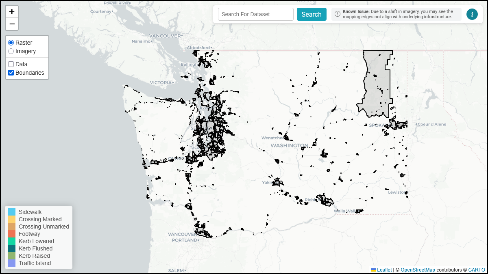
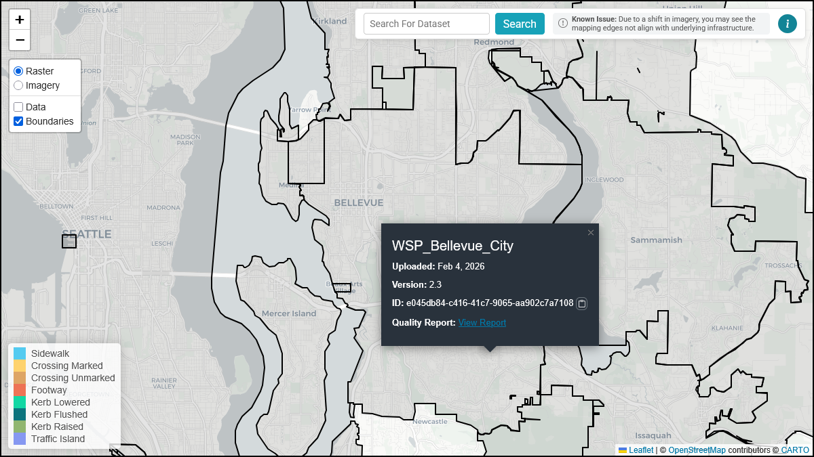

<!-- @format -->

## Boundaries

This guide explains how to view and interact with dataset boundaries in the OS-CONNECT Data Viewer, including viewing boundary and dataset details and accessing QA/QC quality reports.

_For a list of all guides on the TCAT Wiki, refer to the [Guides List](../../../guides-list/index.md)._

---

### Dataset Boundaries

Dataset boundaries are geographic polygons that outline the coverage area of each dataset in the OS-CONNECT collection. Each boundary represents a jurisdiction (city, county, or other area) for which pedestrian data has been produced.

To view dataset boundaries, ensure the **Boundaries** toggle is enabled in the [layer toggles](interface.md#layer-toggles).

{ width="826" }

---

### Viewing Boundary Details

Left-click in a dataset boundary polygon to view a popup containing details about that dataset:

| Field              | Description                                                         |
|:-------------------|:--------------------------------------------------------------------|
| **Name**           | The name of the dataset (typically a jurisdiction name)             |
| **Uploaded**       | The date the dataset was uploaded to the TDEI platform              |
| **Version**        | The version number of the dataset                                   |
| **ID**             | The unique TDEI Dataset ID (with a **Copy** button)                 |
| **Quality Report** | A **View Report** link that opens the QA/QC Report for that dataset |

{ width="826" }

!!! tip

    Use the **Copy** button next to the ID to copy the TDEI Dataset ID to your clipboard for reference or use in other TDEI tools.

The following **naming conventions** are used:

```
WSP_NAME_TYPE
```

- **WSP**: Washington State Proviso
- **Name**: The name of the jurisdiction or area
- **Type**: The type of area covered
    - **City** or **UI** (unincorporated)

---

### QA/QC Quality Reports

Each dataset boundary card includes space for a **Quality Report** link. Selecting **View Report** opens the QA/QC quality report for that dataset, which evaluates the quality, completeness, and usefulness of the pedestrian infrastructure data for that jurisdiction.

The QA/QC report helps planners, transportation professionals, and community members understand whether the data for a given area is ready to support accessibility, safety, and connectivity initiatives.

!!! info

    For detailed guidance on reading and interpreting QA/QC reports, refer to the [QA/QC Reports User Manual](../../qa-qc/user-manual/index.md).

---

### Next Steps

- Explore the [data](data.md) layer to view feature types and their attributes
- Learn how to [report issues](feedback.md) with the data
