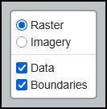
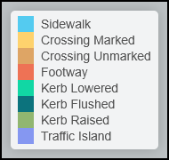

<!-- @format -->

## Interface Overview

This guide introduces the OS-CONNECT Data Viewer map interface, including the base map toggle, layer toggles, legend, search, and map navigation.

_For a list of all guides on the TCAT Wiki, refer to the [Guides List](../../../guides-list/index.md)._

---

### Map Overview

The OS-CONNECT Data Viewer displays an interactive map of the OS-CONNECT pedestrian network dataset for Washington State. When you first open the Data Viewer, the map is centered on Seattle, showcasing the extent and depth of available data.

{ width="826" }

The interface consists of the following key elements:

| Element               | Location    | Description                                                                           |
|:----------------------|:------------|:--------------------------------------------------------------------------------------|
| **Map View**          | Center      | The main interactive map displaying pedestrian network features                       |
| **Zoom Controls**     | Top left    | Plus (++plus++) and minus (++minus++) buttons for zooming in and out                  |
| **Base Map Toggle**   | Top left    | Switches between Raster and Imagery base maps (exclusive — only one active at a time) |
| **Data Toggle**       | Top left    | Toggles visibility of all pedestrian network feature data on or off                   |
| **Boundaries Toggle** | Top left    | Toggles visibility of dataset boundary polygons on or off                             |
| **Legend**            | Bottom left | Color-coded key identifying each feature type on the map                              |
| **Search**            | Top right   | Search bar for finding datasets by name                                               |
| **Message**           | Top right   | Displays notices about known issues (e.g., imagery alignment)                         |
| **About this Viewer** | Top right   | Opens a popup with usage information and the date the data was last updated           |

---

### Base Map Options

The Data Viewer offers two base map options, accessible via the toggle in the top-left corner of the map. The toggle is **exclusive** — only one base map can be active at a time.

| Base Map    | Description                                                                                       |
|:------------|:--------------------------------------------------------------------------------------------------|
| **Raster**  | A light CartoDB Positron street map (default). Best for clearly viewing the data features.        |
| **Imagery** | Aerial/satellite imagery. Useful for comparing mapped features against real-world infrastructure. |

{ width="826" }

!!! tip

    The Raster base map provides the best contrast for viewing pedestrian network features. Switch to Imagery when you want to verify whether mapped features align with visible real-world infrastructure.

!!! note "Known Issue"

    Due to a shift in imagery, you may see the mapped edges not align with the underlying infrastructure when using the Imagery base map. This is a known issue with the imagery source and does not necessarily indicate an error in the pedestrian network data.

---

### Layer Toggles

Two independent layer toggles are located in the top-left corner of the map:

- **Data** — Toggles the visibility of all pedestrian network features (sidewalks, crossings, footways, curbs, and traffic islands) on or off
- **Boundaries** — Toggles the visibility of dataset boundary polygons on or off

Both toggles operate independently — you can view data features with or without boundary polygons, or view boundaries alone without data features.



!!! tip

    Turn off the **Data** layer when you want to focus on which jurisdictions have datasets available, or turn off **Boundaries** to reduce visual clutter when exploring feature data.

---

### Legend

The legend is displayed in the bottom-left corner of the map and identifies the color used for each feature type:

| Color      | Feature Type        |
|:-----------|:--------------------|
| Light blue | Sidewalk            |
| Yellow     | Crossing (Marked)   |
| Tan/orange | Crossing (Unmarked) |
| Red-orange | Footway             |
| Teal       | Kerb (Lowered)      |
| Dark teal  | Kerb (Flushed)      |
| Green      | Kerb (Raised)       |
| Purple     | Traffic Island      |

{ width="200" }

For detailed descriptions of what each feature type represents, see [Data - Feature Types](data.md#feature-types).

---

### Navigating the Map

#### Zooming

- **Scroll wheel:** Scroll up to zoom in, scroll down to zoom out
- **Double-click:** Quickly zoom in on a specific location
- **Zoom buttons:** Use the plus (++plus++) and minus (++minus++) buttons in the top-left corner
- **Pinch to zoom:** On touch devices, use two fingers to zoom in or out

!!! important

    Feature details (hover popups) only appear at **zoom level 16 or higher**. Zoom in to interact with individual features.

#### Panning

- **Click and drag:** Click and hold to drag the map in any direction
- **Touch and drag:** On touch devices, use one finger to pan the map

---

### Search

The search bar, located in the top-right corner of the map, allows you to find datasets by name. This is useful for quickly navigating to a specific jurisdiction's data.


#### How to Search

1. Click the **Search For Dataset** field in the top-right corner of the map
2. Type the name (or partial name) of the dataset you're looking for and select **Search**
3. The map will automatically zoom to fit the matching result

!!! tip

    Search is case-insensitive and supports partial matches. For example, typing "gold" will match "WSP_Goldendale_City".

---

### URL-Based Navigation

The OS-CONNECT Data Viewer supports URL hash navigation, which encodes the current map view (zoom level, latitude, and longitude) directly in the browser's URL. This feature enables you to share specific map views with others or bookmark locations for future reference.

#### URL Format

The URL format follows this pattern:

```
https://osconnect-viewer.tdei.us/#map=ZOOM/LAT/LON
```

For example:

```
https://osconnect-viewer.tdei.us/#map=16/47.6062/-122.3321
```

This URL opens the Data Viewer centered on downtown Seattle at zoom level 16.

#### How to Use

- **Share a view:** Copy the URL from your browser's address bar — it automatically updates as you navigate the map. Share the URL with others so they can see the same map view.
- **Bookmark a location:** Bookmark the URL in your browser to return to the same map view later.
- **Open a direct link:** Paste a Data Viewer URL into your browser to jump directly to a specific location and zoom level.

---

### About this Viewer

The **About this Viewer** info button (located in the top-right corner of the interface) opens the **OSConnect Dataset Viewer** popup, which provides:

- A brief explanation of how to use the Data Viewer
- Instructions for downloading datasets
- The date the data was last updated

---

### Next Steps

- Learn about [boundaries](boundaries.md) and accessing QA/QC reports
- Explore the [data](data.md) layer, feature types, and attributes
