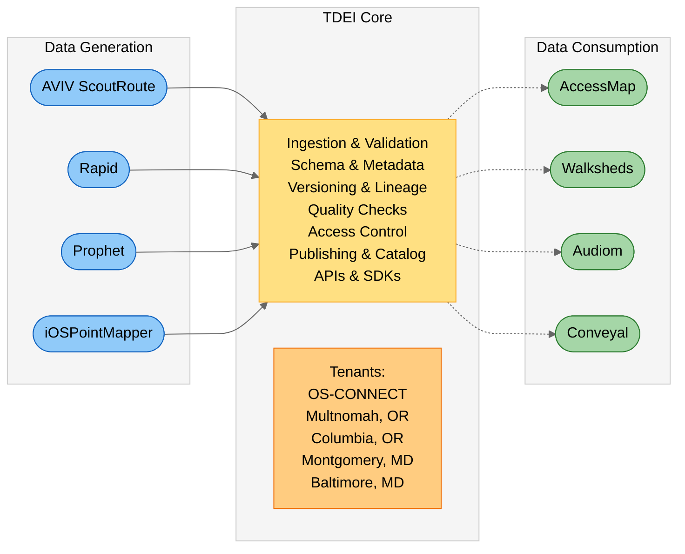

<!-- @format -->

## TDEI

The **Transportation Data Exchange Initiative** (TDEI) is focused on developing a shared, standardized framework for transportation data, enabling seamless integration across mobility systems. This project aims to provide mobility benefits for travelers and service providers by collecting and providing infrastructure to sustainably support open data about sidewalks, transit paths, and on-demand transit services. Through supporting the collection, maintenance, and exchange of detailed data on pedestrian pathways, transit networks, and on-demand services, TDEI lays the groundwork for more effective transportation planning and innovation.

Reliable data is essential for decision-making. TDEI addresses gaps in transportation data through a three-pronged approach:

- **Enhance data standards** to include information relevant to all travelers and transit stakeholders.
- **Provide tools and data infrastructure** reducing barriers for data stewards to collect, vet, maintain and use traveler-centric transportation data at scale.
- **Demonstrate our work** through **pilot data collections** with private and public partners, and **demonstration projects** that make use of our data.

With the support of the **Transportation Data Exchange Initiative** (TDEI), the OpenSidewalks project and its suite of tools—including AccessMap—provide detailed insights into sidewalk connectivity and pedestrian networks. These resources equip individuals, civic organizations, and government agencies with the data needed to support informed mobility planning and decision-making.

_TDEI is a project sponsored by the [ITS4US Deployment Program](https://www.its.dot.gov/its4us/index.htm), focused on improving frameworks for transportation services and infrastructure. By developing open-source data collection tools, digital infrastructure, and governance models, TDEI enables seamless public-private data exchange and interoperability._

---

### User Registration and Access

All TDEI users register through the same process via the [TDEI Portal](https://portal.tdei.us/) and receive an API key and access credentials. Users are differentiated by their assigned roles and permissions.

API keys are used to retrieve data from TDEI. Access credentials are used to log into the portal, retrieve or regenerate API keys, and upload data.

Refer to the [TDEI Portal Account Registration Guide](portal/user-manual/account-registration.md) for instructions on registering for a TDEI account.

---

### Roles

#### Data Consumer

A data consumer is a user who will read data from the TDEI. Any person can register with the TDEI to be a data consumer.

#### Point of Contact

Each Project Group must have a designated Point of Contact (PoC). They have the authority to approve access for data producers for that Project Group. The purpose of the PoC is to ensure that staff from the related agency, company, or group with the proper authority are approving access for data producers.

#### Data Producer

A data producer is a user who will contribute data to the TDEI.

- **Flex Data Producer**

The `flex-data-generator` role allows a user to create GTFS-Flex data.

- **Pathways Data Producer**

The `pathways-data-generator` role allows a user to create GTFS-Pathways data.

- **OpenSidewalks Data Producer**

The `osw-data-generator` role allows a user to upload OpenSidewalks data.

---

### Architecture

A multi‑tenant data sharing and exchange platform that supports the full lifecycle of transportation datasets, from collection and updates to publication and consumption.

---

### TDEI Data Producing Applications

Transportation Data Exchange Initiative Data Producing Applications

#### [TDEI Workspaces](../workspaces/index.md)

Platform providing dataset editing functionality.

#### [Rapid](../rapid/index.md)

Embedded in-browser web editor.

#### [AVIV ScoutRoute](../aviv-scoutroute/index.md)

Mobile applications for both Android and iOS.

#### [JOSM](../josm/index.md)

Desktop application for advanced editing.

---

### TDEI Data Consuming Applications

Transportation Data Exchange Initiative Data Consuming Applications

#### [AccessMap](../accessmap/index.md)

Accessibility-forward customizable router.

#### [TDEI Walksheds](../walksheds/index.md)

Tool for analyzing pedestrian infrastructure and access to amenities.

---

### Guides

TDEI Guides

_For a list of all guides on the TCAT Wiki, refer to the [Guides List](../guides-list/index.md)._

#### [TDEI Portal](portal/index.md) Guides

The **[TDEI Portal](https://portal.tdei.us/)** is the web interface for the Transportation Data Exchange Initiative (TDEI).

##### [TDEI Portal User Manual](portal/user-manual/index.md)

This user manual explains how to use the TDEI Portal platform.
