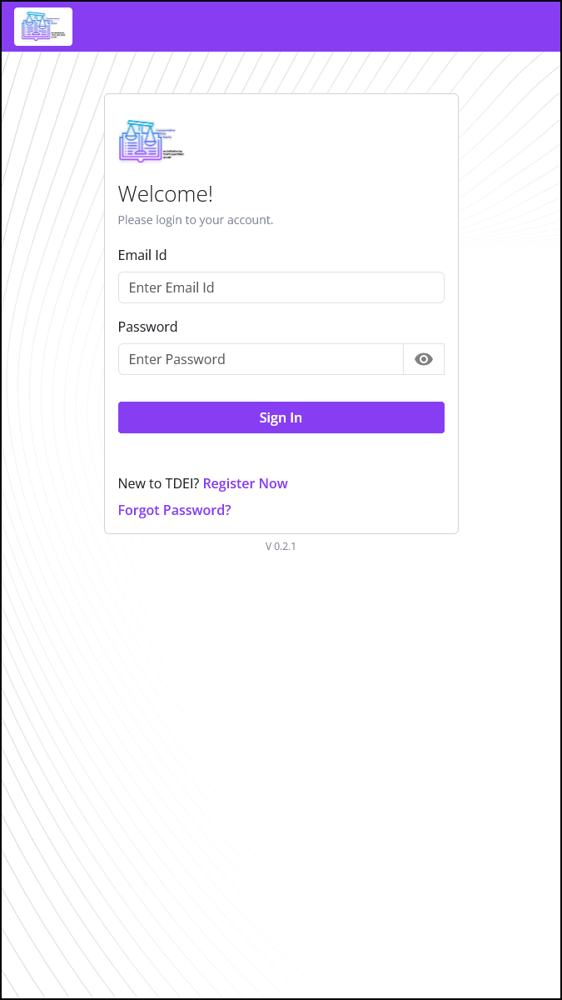

<!-- @format -->

# AVIV ScoutRoute User Manual

This guide explains how to install and use the AVIV ScoutRoute mobile app.

_For a list of all guides on the TCAT Wiki, refer to the [Guides List](../../../../../guides-list/index.md)._

---

Work in progress! Resolve "FIXME"s before merge.

---

- [AVIV ScoutRoute User Manual](#aviv-scoutroute-user-manual)
  - [1 Introduction](#1-introduction)
  - [2 Installation](#2-installation)
    - [2.1: Apple iPhone Users](#21-apple-iphone-users)
    - [2.2: Android Users](#22-android-users)

## 1 Introduction

This document enables users to try out AVIV ScoutRoute (in conjunction with a workspace) where one can answer quests. After reading this document, users should be able to install AVIV ScoutRoute, as well as view and complete quests in the app.

AVIV ScoutRoute is a volunteerism game for crowdsourcing pedestrian and accessibility information, and is an adaptation of the [StreetComplete](https://github.com/westnordost/StreetComplete) project. Users see an overhead map view, with easy-to-tap icons representing ‘quests’. Quests are simple surveys for missing labels in an [OpenStreetMap](https://www.openstreemap.org/)\-style workspace; for example, a given quest may ask the user to say whether the sidewalk they are using is made of concrete, asphalt, or another material.

Note that AVIV ScoutRoute was rebranded from the original "GoInfoGame" / "GiG" branding, and some materials have not yet been updated to reflect this.

## 2 Installation

Based on the mobile device you use, please follow the instructions below to install AVIV ScoutRoute.

### 2.1: Apple iPhone Users

**Step 1:** Make sure you have an Apple Account (formerly called an "Apple ID"). This is the email address associated with your iPhone and all Apple services.

**Step 2:** Use this Apple Account to register yourself in the TDEI system.

1. Visit [https://portal.tdei.us/](https://portal.tdei.us/)

2. Tap **“Register Now”**

3. Complete the form and press **“Create Account”**

    _Password requirements: Minimum of 8 characters in length; requires at least one lower case letter, one upper case letter, one special character, and a number._

 

**Step 3:** Install AVIV ScoutRoute\!

1. Using Safari, visit: [https://testflight.apple.com/join/hpzSaUdQ](https://testflight.apple.com/join/hpzSaUdQ)

1. Tap the **"View in App Store"** button under the "Step 1" section

2. Install Testflight via the App Store

**Note:** TestFlight, once installed, shows a "Ready to Test" screen and has a "Redeem" button which, when pressed, opens a "Redeem Code" popup which asks for a TestFlight Invitation Code. **Disregard this and return to Safari to continue.**

4. Return to Safari and tap **"View in TestFlight"** under the "Step 2" section

5. Tap **"Install"**
6. Tap **"Open"**

7. Tap **"Next"**
8. Tap **"Start Testing"**

**Step 4:** Login to the AVIV ScoutRoute mobile application using your TDEI Account

If prompted to select an **Environment**, select **"Production"**

**Step 5:** Reach out to your project's point of contact and provide them with your name and Apple Account. They will add you to the appropriate Project Group and assign your role.

### 2.2: Android Users

**Step 1:** Make sure you have reliable access to an Email account.

**Step 2:** Use this Email ID to register yourself in the TDEI system.

1. Visit [https://portal.tdei.us/](https://portal.tdei.us/)

2. Click “Register Now”

3. Complete the form and press “Create Account”

    _Password requirements: Minimum of 8 characters in length; requires at least one lower case letter, one upper case letter, one special character, and a number._

 
