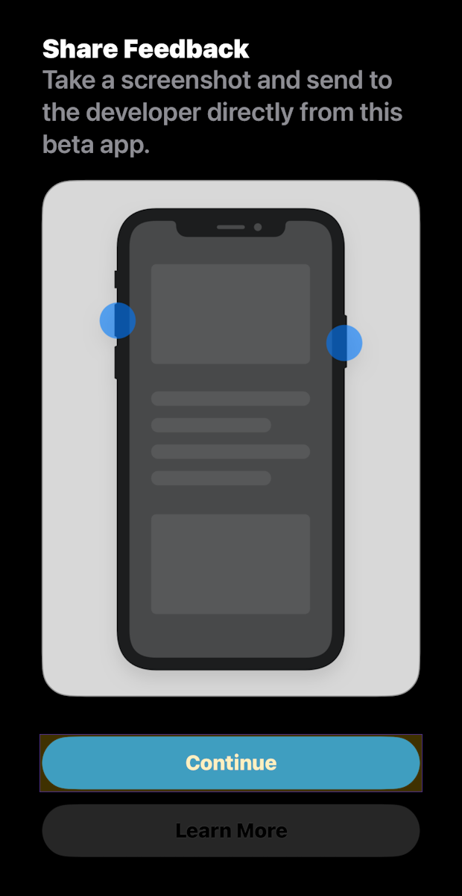

<!-- @format -->

# AVIV ScoutRoute User Manual

This guide explains how to install and use the AVIV ScoutRoute mobile app.

_For a list of all guides on the TCAT Wiki, refer to the [Guides List](../../../../../guides-list/index.md)._

---

- [AVIV ScoutRoute User Manual](#aviv-scoutroute-user-manual)
  - [Introduction](#introduction)
  - [Installation](#installation)
    - [Apple iPhone Users](#apple-iphone-users)
    - [Android Users](#android-users)
  - [Using AVIV ScoutRoute](#using-aviv-scoutroute)
    - [Background and Basic App Assumptions](#background-and-basic-app-assumptions)
    - [Viewing and Answering Quests](#viewing-and-answering-quests)
    - [Complete a Quest in the App](#complete-a-quest-in-the-app)
    - [Quest Types and How to Answer Them](#quest-types-and-how-to-answer-them)
  - [App Settings \& Feature Controls](#app-settings--feature-controls)
    - [Settings Menu](#settings-menu)
      - [User Profile](#user-profile)
      - [Manage Quests](#manage-quests)
      - [Download Data](#download-data)
      - [Switch Workspace](#switch-workspace)
    - [Hidden Elements](#hidden-elements)
    - [Imagery Layer Control](#imagery-layer-control)
    - [Undo Changes](#undo-changes)
  - [Next Steps](#next-steps)
  - [Additional Resources](#additional-resources)

## Introduction

This document enables users to try out AVIV ScoutRoute (in conjunction with a workspace) where one can answer quests. After reading this document, users should be able to install AVIV ScoutRoute, as well as view and complete quests in the app.

AVIV ScoutRoute is a volunteerism game for crowdsourcing pedestrian and accessibility information, and is an adaptation of the [StreetComplete](https://github.com/westnordost/StreetComplete) project. Users see an overhead map view, with easy-to-select icons representing ‘quests’. Quests are simple surveys for missing labels in an [OpenStreetMap](https://www.openstreemap.org/)\-style workspace; for example, a given quest may ask the user to say whether the sidewalk they are using is made of concrete, asphalt, or another material.

Note that AVIV ScoutRoute was rebranded from the original "GoInfoGame" / "GiG" branding, and some materials have not yet been updated to reflect this.

## Installation

Depending on the type of mobile device you use, follow the instructions below to install AVIV ScoutRoute.

### Apple iPhone Users

**Step 1:** Make sure you have an Apple Account (formerly called an "Apple ID"). This is the email address associated with your iPhone and all Apple services.

**Step 2:** Use this Apple Account to register yourself in the TDEI system.

1. Visit [https://portal.tdei.us/](https://portal.tdei.us/)

2. Select **"Register Now"**

3. Complete the form and select **"Create Account"**

    _Password requirements: Minimum of 8 characters in length; requires at least one lower case letter, one upper case letter, one special character, and a number._

{ width="400" } { width="400" }

**Step 3:** Install AVIV ScoutRoute!

1. Using Safari, visit: [https://testflight.apple.com/join/hpzSaUdQ](https://testflight.apple.com/join/hpzSaUdQ)

Alternatively, scan the QR code below:

{ width="200" }

{ width="400" } { width="400" }

1. Select the **"View in App Store"** button under the "Step 1" section

2. Install TestFlight via the App Store

**Note:** TestFlight, once installed, shows a "Ready to Test" screen and has a "Redeem" button which, when pressed, opens a "Redeem Code" popup which asks for a TestFlight Invitation Code. **Disregard this and return to Safari to continue.**

4. Return to Safari and select **"View in TestFlight"** under the "Step 2" section

{ width="400" } { width="400" }

1. Select **"Install"**
2. Select **"Open"**

{ width="400" } { width="400" }

1. Select **"Continue"**
2. Select **"Continue"**

**Step 4:** Login to the AVIV ScoutRoute mobile application using your TDEI Account

{ width="400" }

**Step 5:** Reach out to your project's point of contact and provide them with your name and Apple Account email address. They will add you to the appropriate Project Group and assign your role.

### Android Users

**Step 1:** Make sure you have reliable access to an Email account.

**Step 2:** Use this Email ID to register yourself in the TDEI system.

1. Visit [https://portal.tdei.us/](https://portal.tdei.us/)

2. Click "Register Now"

3. Complete the form and press "Create Account"

    _Password requirements: Minimum of 8 characters in length; requires at least one lower case letter, one upper case letter, one special character, and a number._

{ width="400" } { width="400" }

**Step 3:** Install AVIV ScoutRoute!

1. Accept the Tester Invitation

    1. You'll receive an email invite or direct link from either your project's point of contact or the developer team

        1. External (non-TCAT) users should use the following invite link:
           [https://appdistribution.firebase.dev/i/63d3d906e42fb64d](https://appdistribution.firebase.dev/i/63d3d906e42fb64d)

            Alternatively, scan the QR code below:

            { width="200" }

    2. On your mobile device, click on the link and it will open in your default browser

    3. Sign in with your Google Account (must match the invite email)

    4. Select "Accept Invitation" to join the tester group

{ width="400" } { width="400" }

2. Install the Firebase App Tester App

    1. Download the Firebase App Tester application from the email that is sent once the invite is accepted, or navigate to [appdistribution.firebase.google.com](http://appdistribution.firebase.google.com)

    2. Install Firebase App Tester

    3. Open the app

    4. Sign in with the same Google Account used in Part 1 above

    5. A list of available apps will be displayed

3. Download AVIV ScoutRoute

    1. In the App Tester app, find the AVIV ScoutRoute app under "My Apps"

    2. Select "Download" to install

    3. Follow any on-screen instructions and grant any necessary permissions

{ width="400" } { width="400" }

**Step 4:** Login to the AVIV ScoutRoute mobile application using your TDEI Account

{ width="400" }

**Step 5:** Reach out to your project's point of contact and provide them with your name and email address. They will add you to the appropriate Project Group and assign your role.

## Using AVIV ScoutRoute
### Background and Basic App Assumptions

| Description | Screenshot |
| :----------- | :----------: |
| The app is primarily designed for use in a typical urban setting. It doesn't directly assume as structured a block setting as shown in the picture, but there is a vocabulary used for the main components:   • **ROAD INTERSECTIONS** are the areas where car roads intersect and **CROSSINGS** provide pedestrians the affordance to get across a car path.   • **CROSSINGS** are the designated pedestrian paths between **CURBs**. CROSSINGS are spaces shared with cars on the road.   • Between intersections are **BLOCKs**, where a road has one or two **SIDEWALKs** (defined as sidepaths to the road intended for pedestrians).   • Consequently, the app does have some embedded assumptions that are made about sidewalks being easily identifiable along a BLOCK between two intersections. Some of the questions you'll be asked in the survey about the SIDEWALKS assume you can easily walk the length of the sidewalk and count elements like light poles, driveways, and potholes. | { width="600" } |
| Icons on the screen will show where there are opportunities to fill in surveys or quests. There are three types of quests: **Sidewalk**, **Half-Crossing**, and **Curb**.  In the image of the intersection, you can see three different icon types. Intersections are the most contentious environments for pedestrians. Most of our questions and surveys will focus on the crossings and curb areas. Here we define and provide images to explain what we mean by some of the terms. | { width="600"} |
| The **Sidewalk quest icon** depicts a path separating two areas filled with different colors — grey and blue. In the image, it is circled in bright green. The **Sidewalk quest survey** covers the entire stretch of the pedestrian sidepath along the road, from one intersection to the other.  The **Half-crossing quest icon** shows a white pedestrian on a blue background (circled in light blue). The **Half-Crossing quest** pertains to the part of the crossing that intersects with one direction of traffic. When asked about signalization, provide the answer relevant to the direction of traffic at that half-crossing.  The **Curb quest icon** displays a white wheelchair outline on a blue background (circled in pink). The **Curb quest survey** pertains to the curb point along the sidewalk. When we use the term *corner*, we mean the pedestrian area where two sidewalks intersect (shown filled in white). | { width="800" height= "500"} |
| Transportation planners use many types of remedies to improve safety and access for pedestrians.  Two such improvements are:   • **Pedestrian refuge islands** — designated pedestrian spaces dividing a crossing, allowing pedestrians to stand safely mid-street.  • **Curb extensions (curb bulbs)** — areas where the curb extends into the street, shortening crossings, calming traffic, and creating more pedestrian space.  These features make pedestrians more visible and crossings safer. | { width="600" } { width="600" } |

### Viewing and Answering Quests
| Step | Screenshot |
| :---- | :----: |
| **Open the AVIV ScoutRoute app** on your mobile device. | { width="600"} |
| On the **home screen**, select the workspace you would like to work in. If you are unsure which workspace to choose, please reach out to the UW team. | { width="600"} |
| The app will now display **available quests** in the area around you. A quest in AVIV ScoutRoute is a small piece of information to gather about the built environment. | { width="600" } |
| Each quest type is represented by a **circular icon**. You can explore available quests by tapping on the icons to bring up details of what you need to find. Quests can require different types of information, like entering a number, choosing from a list of options, or taking a measurement. Tapping on the “X” icon in the upper right will close this quest. | { width="600" } |
| To keep the background map easy to see, **quest icons stack up**. To see every available quest, make sure you **zoom in**! | { width="600" } |

### Complete a Quest in the App

| Step | Screenshot |
| :---- | :----: |
| To complete a quest, first **tap on the icon** of the quest you want to do.  Provide the requested information by entering it or making a selection. | { width="600"} |
| Once you’ve **double-checked** the data you entered, tap the **“Submit”** button to send the information. | { width="600" } |

### Quest Types and How to Answer Them 

While completing quests in the AVIV ScoutRoute app, you will encounter different types of questions depending on what kind of information needs to be collected.  
Each question type requires a different form of input — such as choosing an option, selecting multiple options, entering a number, or typing free-form text.

The examples below show how to identify and respond to each quest type.

| Quest Type | Screenshot |
| :---- | :----: |
| **1. Exclusive Choice (Single Select)**   • Choose only one answer that best represents your observation. • Tap an image or button to select — it will be highlighted with a **pink border**. • Tap again to change your selection.  **Example:** “What is this sidewalk’s surface type?” | {width="600"} |
| **2. Numeric Entry**   • Enter a numeric value using the on-screen keypad. • Follow the unit specified in the question (e.g., inches, feet).  **Example:** “How wide is this sidewalk, in inches?” | { width="600" } |
| **3. Multi-Select Choice**   • Select one or more applicable options for the same question. • Each selected option will be outlined in **pink**. • Tap again to deselect if needed.  **Example:** “What types of obstructions are present along this sidewalk?” | { width="600" } |
| **4. Free Form Text**   • Some questions require a short description explaining your choice. • Maximum character limit: **250 characters**.  **Example:** After selecting “Other” for surface type, describe what the material is (e.g., “interlocking tiles”, “rubber mat”, etc.). | { width="600" } |
| **5. Group Quest Selection**   • Select one or more applicable options. • Each selected option will change to a **purple checkmark**. • Tap “Answer Quests” to apply the same responses to all selected segments. • Tap again to deselect if needed.  **Example:** “What types of obstructions are present along this sidewalk?” | { width="600" } |

Once all required questions are answered, tap **Submit**.  
Your responses are saved, and that quest will no longer be shown on the map (it disappears from the available quests list).

## App Settings & Feature Controls

This section explains all the in-app buttons, settings, and user options available from the workspace view.  
Each subsection below includes screenshots for clarity.

---

### Settings Menu

{ width="400" }

Tap the **Settings (gear icon)** in the top bar to open the workspace menu.

This menu includes the following options:

| Option | Description |
| :---- | :---- |
| **User Profile** | Displays the logged-in user’s details, including name, email, and login preferences. |
| **Manage Quests** | Lets users choose which map features (e.g., Sidewalks, Crossings, Curbs) to survey and manage visibility of hidden elements. |
| **Download Data** | Downloads map data for the visible area in the workspace. |
| **Switch Workspace** | Returns to the list of available workspaces. |

---

#### User Profile

| | |
| :---- | :----: |
| { width="600" } | { width="600" } |

**Displays:**
- User Name & Email  
- Login Preferences (e.g., Face ID toggle)  
- Logout Button  

This section allows you to manage authentication or sign out from the app.

---

#### Manage Quests

|  |  |
| :---- | :----: |
| { width="600" } | { width="600" } |

Allows users to select which types of map features they want to survey.  
Available feature types include:
- **Sidewalks**  
- **Crossings**  
- **Kerbs**

You can toggle these features on or off to control their visibility on the map.

---

#### Download Data

| |  |
| :---- | :----: |
| { width="600" } | { width="600" } |

Downloads all visible map features (such as sidewalks, crossings, and kerbs) within the highlighted area shown on the screen.  
The shaded boundary indicates the **exact region** of data that will be downloaded.

#### Switch Workspace 

| | |
| :---- | :----: |
| { width="600" } | { width="600" } |

- Opens the list of all available **Workspaces** linked to your account.  
- Allows you to quickly switch between different projects or datasets without logging out.  
- Useful when working across multiple areas or dataset versions — for example, moving from *Kondapur Dataset* to *Snohomish City Dataset*.

---

### Hidden Elements

|  |  |
| :---- | :----: |
| { width="600" } | { width="600" } |

To temporarily remove a feature from the map, tap **“Hide this”** from the element details view.

The **Hidden Elements** section lists all map elements hidden manually.  
Users can:
- Unhide individual elements, or  
- Tap **“Unhide All”** to restore everything at once.

---

### Imagery Layer Control

{ width="400" }

Tap the **Layers** icon to view and select from available **Custom Imagery** sources.  
These can include:
- Satellite imagery  
- Street maps  
- Basemap alternatives configured from the workspace settings.

---

### Undo Changes

| | |  |
| :---- | :----: | :---- |
| { width="600" } | { width="600" } | { width="600" } |

When the **Undo** button is tapped, it opens a panel listing all edits made by the user.

Each entry shows the **element ID** and modified keys.  
Users can **tap to review changes** and select **Revert** to undo specific edits.

## Next Steps

You should now be ready to complete quests in AVIV ScoutRoute! Please reach out to the UW team if you have questions or concerns that have not been answered in this document.

## Additional Resources

-   [AVIV ScoutRoute iOS Release Notes](https://docs.google.com/document/d/1i9FUVdXElJ8zUk3BTvbW8AOQ-lYz_6Q6c1p8wZXYZxc/edit?usp=sharing)
-   [AVIV ScoutRoute Android Release Notes](https://docs.google.com/document/d/1jaiyNtAOCKeUVBqjmLveI78g4yhWH222DLg7Ev4VO5g/edit?usp=sharing)
