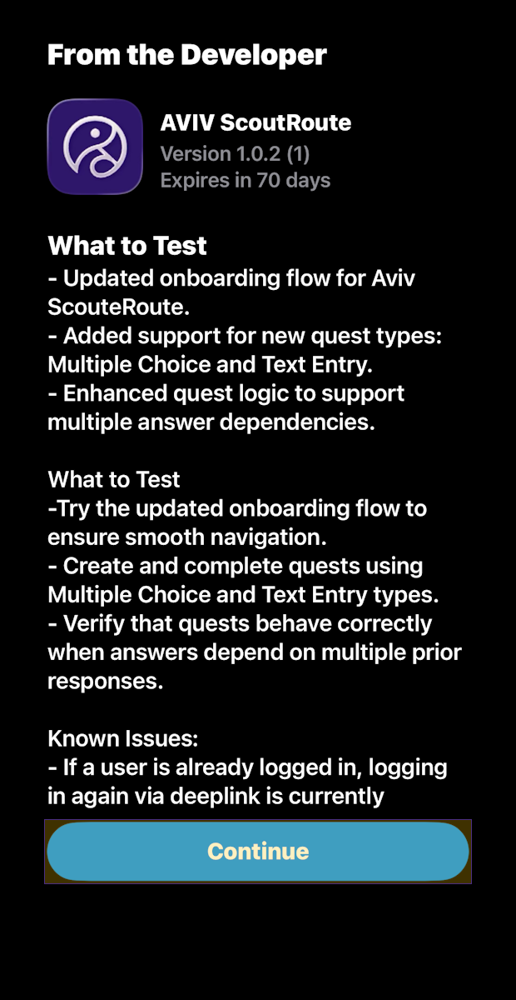

<!-- @format -->

# AVIV ScoutRoute User Manual

This guide explains how to install and use the AVIV ScoutRoute mobile app.

_For a list of all guides on the TCAT Wiki, refer to the [Guides List](../../../../../guides-list/index.md)._

---

- [AVIV ScoutRoute User Manual](#aviv-scoutroute-user-manual)
  - [Introduction](#introduction)
  - [Installation](#installation)
    - [Apple iPhone Users](#apple-iphone-users)
    - [Android Users](#android-users)
  - [Next Steps](#next-steps)
  - [Additional Resources](#additional-resources)

## Introduction

This document enables users to try out AVIV ScoutRoute (in conjunction with a workspace) where one can answer quests. After reading this document, users should be able to install AVIV ScoutRoute, as well as view and complete quests in the app.

AVIV ScoutRoute is a volunteerism game for crowdsourcing pedestrian and accessibility information, and is an adaptation of the [StreetComplete](https://github.com/westnordost/StreetComplete) project. Users see an overhead map view, with easy-to-select icons representing ‘quests’. Quests are simple surveys for missing labels in an [OpenStreetMap](https://www.openstreemap.org/)\-style workspace; for example, a given quest may ask the user to say whether the sidewalk they are using is made of concrete, asphalt, or another material.

Note that AVIV ScoutRoute was rebranded from the original "GoInfoGame" / "GiG" branding, and some materials have not yet been updated to reflect this.

## Installation

Depending on the type of mobile device you use, follow the instructions below to install AVIV ScoutRoute.

### Apple iPhone Users

**Step 1:** Make sure you have an Apple Account (formerly called an "Apple ID"). This is the email address associated with your iPhone and all Apple services.

**Step 2:** Use this Apple Account to register yourself in the TDEI system.

1. Visit [https://portal.tdei.us/](https://portal.tdei.us/)

2. Select **"Register Now"**

3. Complete the form and select **"Create Account"**

    _Password requirements: Minimum of 8 characters in length; requires at least one lower case letter, one upper case letter, one special character, and a number._

{ width="400" } { width="400" }

**Step 3:** Install AVIV ScoutRoute!

1. Using Safari, visit: [https://testflight.apple.com/join/hpzSaUdQ](https://testflight.apple.com/join/hpzSaUdQ)

Alternatively, scan the QR code below:

{ width="200" }

{ width="400" } { width="400" }

1. Select the **"View in App Store"** button under the "Step 1" section

2. Install TestFlight via the App Store

**Note:** TestFlight, once installed, shows a "Ready to Test" screen and has a "Redeem" button which, when pressed, opens a "Redeem Code" popup which asks for a TestFlight Invitation Code. **Disregard this and return to Safari to continue.**

4. Return to Safari and select **"View in TestFlight"** under the "Step 2" section

{ width="400" } { width="400" }

1. Select **"Install"**
2. Select **"Open"**

{ width="400" } { width="400" }

1. Select **"Continue"**
2. Select **"Continue"**

**Step 4:** Login to the AVIV ScoutRoute mobile application using your TDEI Account

{ width="400" }

**Step 5:** Reach out to your project's point of contact and provide them with your name and Apple Account email address. They will add you to the appropriate Project Group and assign your role.

### Android Users

**Step 1:** Make sure you have reliable access to an Email account.

**Step 2:** Use this Email ID to register yourself in the TDEI system.

1. Visit [https://portal.tdei.us/](https://portal.tdei.us/)

2. Click "Register Now"

3. Complete the form and press "Create Account"

    _Password requirements: Minimum of 8 characters in length; requires at least one lower case letter, one upper case letter, one special character, and a number._

{ width="400" } { width="400" }

**Step 3:** Install AVIV ScoutRoute!

1. Accept the Tester Invitation

    1. You'll receive an email invite or direct link from either your project's point of contact or the developer team

        1. External (non-TCAT) users should use the following invite link:
           [https://appdistribution.firebase.dev/i/63d3d906e42fb64d](https://appdistribution.firebase.dev/i/63d3d906e42fb64d)

            Alternatively, scan the QR code below:

            { width="200" }

    2. On your mobile device, click on the link and it will open in your default browser

    3. Sign in with your Google Account (must match the invite email)

    4. Select "Accept Invitation" to join the tester group

{ width="400" } { width="400" }

2. Install the Firebase App Tester App

    1. Download the Firebase App Tester application from the email that is sent once the invite is accepted, or navigate to [appdistribution.firebase.google.com](http://appdistribution.firebase.google.com)

    2. Install Firebase App Tester

    3. Open the app

    4. Sign in with the same Google Account used in Part 1 above

    5. A list of available apps will be displayed

3. Download AVIV ScoutRoute

    1. In the App Tester app, find the AVIV ScoutRoute app under "My Apps"

    2. Select "Download" to install

    3. Follow any on-screen instructions and grant any necessary permissions

{ width="400" } { width="400" }

**Step 4:** Login to the AVIV ScoutRoute mobile application using your TDEI Account

{ width="400" }

**Step 5:** Reach out to your project's point of contact and provide them with your name and email address. They will add you to the appropriate Project Group and assign your role.

## Next Steps

You should now be ready to complete quests in AVIV ScoutRoute! Please reach out to the UW team if you have questions or concerns that have not been answered in this document.

## Additional Resources

-   [AVIV ScoutRoute iOS Release Notes](https://docs.google.com/document/d/1i9FUVdXElJ8zUk3BTvbW8AOQ-lYz_6Q6c1p8wZXYZxc/edit?usp=sharing)
-   [AVIV ScoutRoute Android Release Notes](https://docs.google.com/document/d/1jaiyNtAOCKeUVBqjmLveI78g4yhWH222DLg7Ev4VO5g/edit?usp=sharing)
