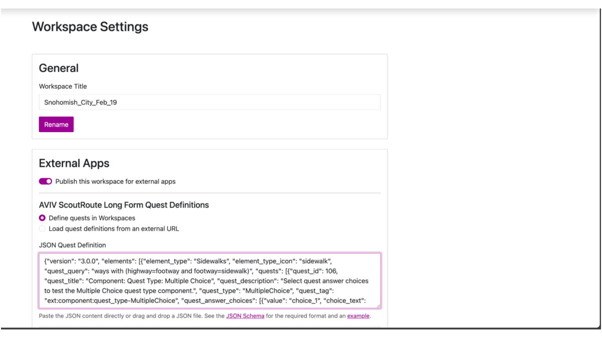
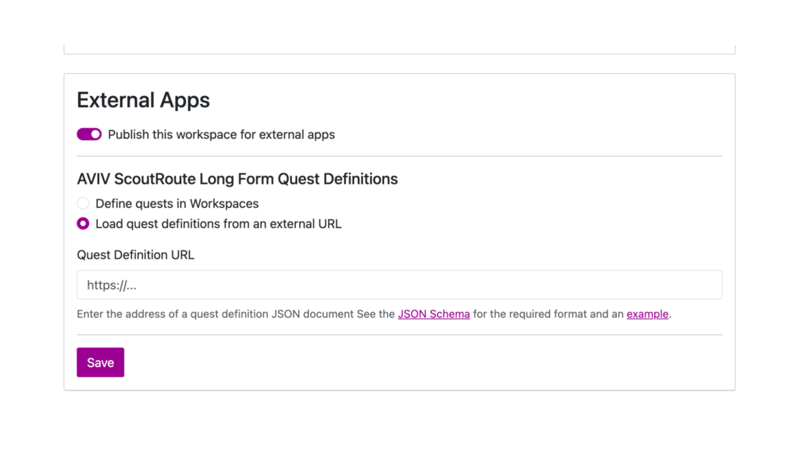

# Add Long Form Quest Definitions to a Workspace

Once the workspace is created, you can add Long Form Quests that define the survey questions displayed in AVIV ScoutRoute.

### Purpose
Long Form Quests define the data collected in the field (e.g., sidewalk continuity, surface material, width).

### File Location
The quest definition can be:

* Defined directly within Workspaces (using the JSON editor), or 
 
* Loaded from an external JSON URL.

### Option A – Define Quests in Workspaces

1. Open the workspace in TDEI Workspaces.  
2. Click the **Settings (⚙️)** icon.  
3. Scroll to **External Apps → AVIV ScoutRoute Long Form Quest Definitions.**  
4. Select **“Define quests in Workspaces.”**  
5. Paste your Long Form Quest JSON into the editor.  
6. Click **Save.**

{ width="800" }

### Option B – Load Quests from External URL

If quest definitions are managed centrally (e.g., on GitHub):

1. Choose **“Load quest definitions from external URL.”**  
2. Enter the hosted JSON URL (e.g., GitHub raw link).  
3. Click **Save.**

{ width="800" }

_See also:_  
* [Long Form Schema](https://raw.githubusercontent.com/TaskarCenterAtUW/asr-quests/refs/heads/main/schema/schema.json)  
* [Example JSON](https://raw.githubusercontent.com/TaskarCenterAtUW/asr-quests/refs/heads/main/examples/example.json)

---

## Long Form JSON Structure Explained
Below is the detailed breakdown of the JSON format used in AVIV ScoutRoute (v3.0.0).

### Top-Level Structure

Every Long Form JSON file has two primary keys:

| Field | Description |
| :---- | :---- |
| **version** | Indicates the schema version being used (e.g., `"3.0.0"`). |
| **elements** | An array of element objects, each representing a type of physical feature (like sidewalks, curbs, or crossings). |

```json
{
  "version": "3.0.0",
  "elements": [ ... ]
}
```

This top-level format ensures backward compatibility with future schema versions while allowing multiple element types within a single quest file.

---

### Element Object

Each **element** represents a physical feature on the map that users will collect data for.  
 For example: sidewalks, crossings, curbs, or bus stops.

| Field | Type | Description |
| :---- | :---- | :---- |
| **element\_type** | string | The name of the feature (e.g., `"Sidewalk"`, `"Crossing"`). |
| **quest\_query** | string | A query expression that defines which map features this element applies to. For example, `"ways with (highway=footway and footway=sidewalk)"`. |
| **element\_type\_icon** | string | The icon name or identifier shown in the ScoutRoute app. |
| **quests** | array | List of **Question Objects** that define what to ask the user for this element. |

```json
{
  "element_type": "Sidewalk",
  "quest_query": "ways with (highway=footway and footway=sidewalk)",
  "element_type_icon": "sidewalk_icon",
  "quests": [ ... ]
}
```

---

### Question Object

Defines each field question.

| Field | Required | Description |
| :---- | :---- | :---- |
| **quest\_id** | Yes | Unique numeric ID |
| **quest\_title** | Yes | Displayed question |
| **quest\_description** | Yes | Instructions |
| **quest\_type** | Yes | Input type (ExclusiveChoice, MultipleChoice, Numeric, TextEntry) |
| **quest\_tag** | Yes | Data tag stored in OSM or export |
| **quest\_answer\_choices** | Optional | For choice-based questions |
| **quest\_answer\_validation** | Optional | For numeric limits |
| **quest\_answer\_dependency** | Optional | To show conditionally |

```json
{
  "element_type": "Sidewalk",
  "quest_query": "ways with (highway=footway and footway=sidewalk)",
  "element_type_icon": "sidewalk_icon",
  "quests": [
    {
      "quest_id": 1,
      "quest_title": "Is the sidewalk continuous?",
      "quest_description": "Select whether the sidewalk is continuous or interrupted.",
      "quest_type": "ExclusiveChoice",
      "quest_tag": "sidewalk:continuous",
      "quest_answer_choices": [
        { "value": "yes", "choice_text": "Yes" },
        { "value": "no", "choice_text": "No" }
      ]
    }
  ]
}
```

---

### Quest Types Summary
| Type | Input | Example |
| :---- | :---- | :---- |
| **Exclusive Choice** | One option only | Yes / No / Unknown |
| **MultipleChoice** | Multiple selections | Ramp, Tactile paving, Warning tiles |
| **Numeric** | Number entry | Width (m), gradient (%) |
| **TextEntry** | Free text | Notes or comments |

**Validation Example (Numeric)**

```json
{
  "quest_id": 301,
  "quest_title": "What is the width of the sidewalk?",
  "quest_description": "Enter width in meters.",
  "quest_type": "Numeric",
  "quest_tag": "width",
  "quest_answer_validation": { "min": 0.5, "max": 10 }
}
```

**Dependency Example**

```json
"quest_answer_dependency": {
  "question_id": 101,
  "required_value": "yes"
}
```
→ The dependent question appears only if Question 101 \= “yes”.

---
**More Long Form Quest Guides**

← [Overview](index.md) · [Adding Long Form Quests](adding-longform-quests.md) · [Configuring Custom Imagery](configuring-custom-imagery.md)
