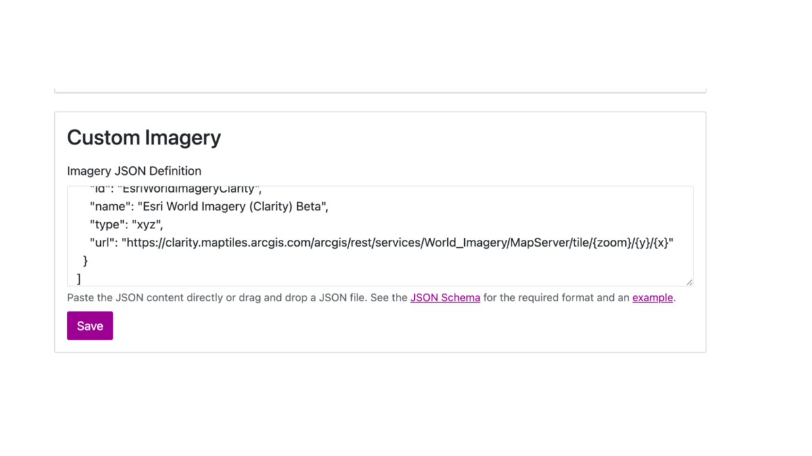

# Configuring Custom Imagery

This guide explains how to add external imagery sources (ex: Esri tile servers) to a Workspace for use in AVIV ScoutRoute.

---

### **Steps**

1. Go to the **Custom Imagery** section in Workspace Settings.  
2. Paste a valid JSON definition (see below).  
3. Click **Save**.

{ width="800" }

**Example**

```json
[
  {
    "id": "EsriWorldImageryClarity",
    "name": "Esri World Imagery (Clarity) Beta",
    "type": "xyz",
    "url": "https://clarity.maptiles.arcgis.com/arcgis/rest/services/World_Imagery/MapServer/tile/{zoom}/{y}/{x}"
  }
]
```
**Reference**

* [Custom Imagery Schema](https://raw.githubusercontent.com/TaskarCenterAtUW/asr-imagery-list/refs/heads/main/schema/schema.json)  
* [Custom Imagery Example](https://raw.githubusercontent.com/TaskarCenterAtUW/asr-imagery-list/refs/heads/main/examples/example.json)

---

### Imagery Definition
The imagery JSON describes a list of imagery sources — for example, aerial or satellite imagery layers used in the application. Each imagery entry tells the app where the images come from, how to display them, and what attribution text to show.

In simple terms, each entry = one imagery provider (like Bing, Mapbox, or local city maps).

### **Structure Overview** 

Each object represents one imagery source and must include these fields:

```json
{
   "attribution": {...},
   "description": "...",
   "extent": {...},
   "icon": "...",
   "id": "...",
   "name": "...",
   "type": "...",
   "url": "..."
 }

```
### **Fields Explained**

| Field | Description | Example |
| :---- | :---- | :---- |
| **id** | A unique identifier for the imagery source. Keep it short, lowercase, and descriptive. This acts as a reference key internally. | `bing_aerial`, `mapbox_satellite` |
| **name** | The display name shown to users in the app UI or dropdown lists. Should be readable and descriptive. | `Bing Aerial`, `Mapbox Satellite` |
| **description** | A short summary describing what the imagery source provides or how it differs from others. | `High-resolution satellite imagery from Bing Maps.` |
| **icon** | URL of a small image or logo used to visually represent the imagery source in the interface. | `https://example.com/icons/bing.png` |
| **url** | The base URL template used to fetch map tiles. Supports `{z}`, `{x}`, and `{y}` placeholders. | `https://example.com/tiles/{z}/{x}/{y}.jpg` |
| **type** | Type of imagery service. Supported values: `xyz`, `tms`, or `wmts`. Most sources use `xyz`. | `xyz` |

### **Imagery Type Details**

| Type | Description |
| :---- | :---- |
| **tms** | Tile Map Service. Tiles start from the bottom-left corner. |
| **wmts** | Web Map Tile Service. Similar to TMS but more standardized. |
| **xyz** | Most common format. Tiles start from the top-left corner. |

#### **Attribution** 

Information about who owns or provides the imagery. It has three parts:  
 \- required: Whether attribution must be shown (true/false)  
 \- text: The credit text (e.g., © Bing Maps)  
 \- url: The provider's website link.

#### **Extent**

Defines where the imagery is valid and how deep you can zoom in.  
 \- max\_zoom: Highest zoom level available (e.g., 19 = very close view)  
 \- polygon: The area coverage, defined as a set of \[longitude, latitude\] coordinates.

**Example of Complete Imagery Entry**
```json
{
   "id": "bing_aerial",
   "name": "Bing Aerial",
   "description": "High-resolution aerial imagery from Bing Maps.",
   "icon": "https://example.com/icons/bing.png",
   "type": "xyz",
   "url": "https://bing.com/tiles/{z}/{x}/{y}.jpg",
   "attribution": {
     "required": true,
     "text": "© Bing Maps",
     "url": "https://bing.com/maps"
   },
   "extent": {
     "max_zoom": 19,
     "polygon": [[ [77.0,17.0],[78.0,17.0],[78.0,18.0],[77.0,18.0],[77.0,17.0] ]]
   }
 }
```
### Quick Summary

| Field | What It Means | Example |
| :---- | :---- | :---- |
| id | Internal unique name | bing\_aerial |
| name | Display name | Bing Aerial |
| description | Short explanation | Satellite imagery from Bing |
| icon | Image or logo URL | https://example.com/icon.png |
| type | Type of map service | xyz |
| url | Tile fetch link | https://.../{z}/{x}/{y}.jpg |
| attribution | Credits to the imagery provider | © Bing Maps |
| extent | Area coverage & zoom level | max\_zoom: 19, polygon: \[coords\] |


---
**More Long Form Quest Guides**

← [Overview](index.md) · [Adding Long Form Quests](adding-longform-quests.md) · [Configuring Custom Imagery](configuring-custom-imagery.md)
