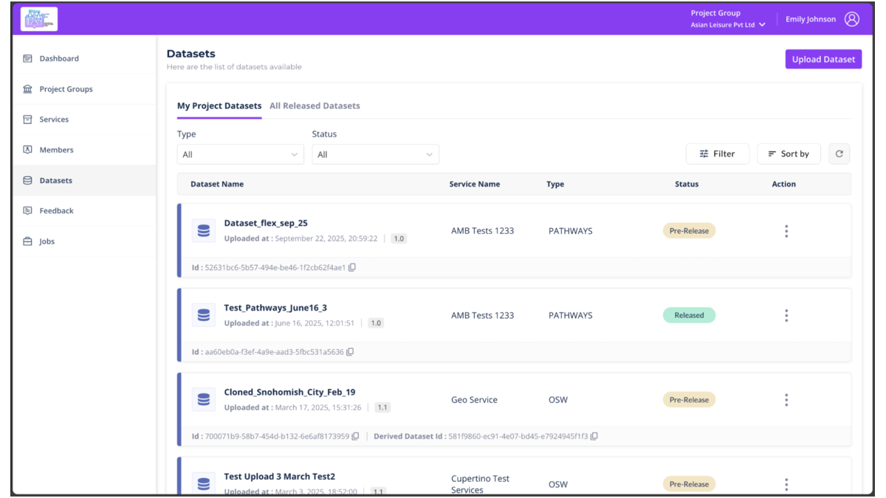
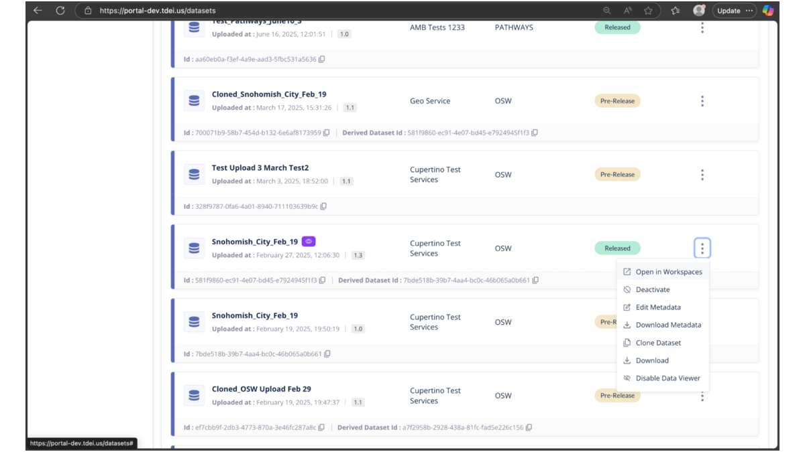
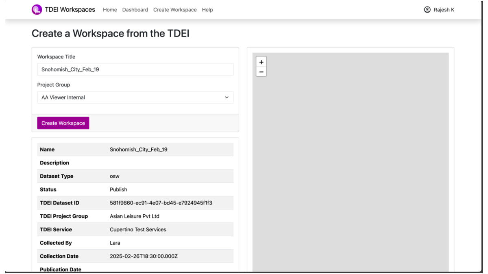
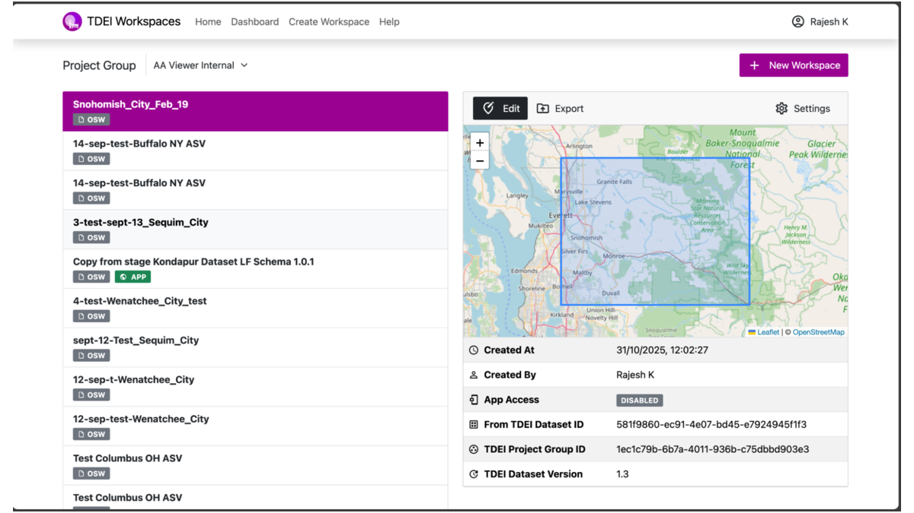

# Create a Workspace in TDEI Portal

Follow these steps to create a Workspace linked to a dataset.

## Steps

1. **Navigate to Datasets**
    - Open the **TDEI Portal**.  
    - Select the dataset you want to use.

    { width="800" }

2. **Open in Workspaces**
    - Click the **three-dot menu (⋮)** next to the dataset.  
    - Select **“Open in Workspaces.”**

    { width="800" }

3. **Create Workspace**
    - You’ll be redirected to **TDEI Workspaces**.  
    - You will find pre-filled:
        - **Workspace Title**
        - **Project Group**
    - Click **Create Workspace**.

    { width="800" }

4. **Verify Workspace**
    - Your new workspace appears in the list under your project group.  
    - You’ll see:
        - Map bounding box auto-filled from dataset geometry  
        - Metadata (dataset version, creator, etc.)  
        - Access control (enabled/disabled)

    { width="800" }

---
**More Long Form Quest Guides**

← [Overview](index.md) · [Adding Long Form Quests](adding-longform-quests.md) · [Configuring Custom Imagery](configuring-custom-imagery.md)
