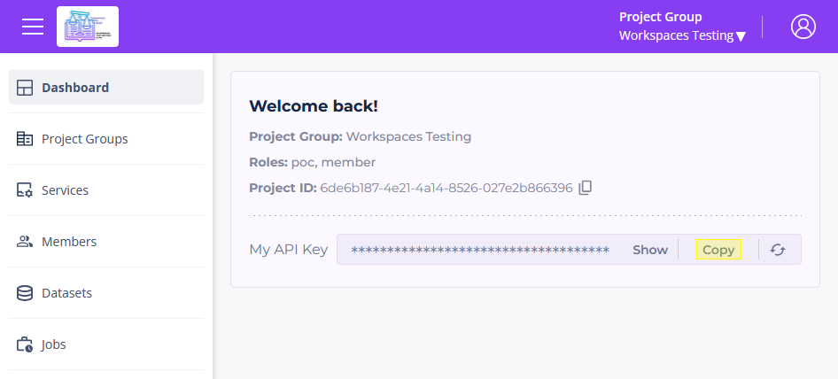

# Workspaces Export Guide

This guide explains how to directly export a dataset in `.osm` format from Workspaces.

_For a list of all guides on the TCAT Wiki, refer to the [Guides List](../../../../guides-list/index.md)._

---

## Legend

1. Keyboard shortcut to press | Action

      (`Shift` + `C`) | Copy

2. Command to enter into terminal

      [`someCommand --arguments <path>`]

## Instructions

### 1. Determine your environment

   1. Prod: [portal.tdei.us](https://portal.tdei.us/) + [workspaces.sidewalks.washington.edu](https://workspaces.sidewalks.washington.edu/)

   2. Stage: [portal-stage.tdei.us](https://portal-stage.tdei.us/) + [workspaces-stage.sidewalks.washington.edu](https://workspaces-stage.sidewalks.washington.edu/)

   3. Dev: [portal-dev.tdei.us](https://portal-dev.tdei.us/login) + [workspaces-dev.sidewalks.washington.edu](https://workspaces-dev.sidewalks.washington.edu/)

### 2. Find your API key

   1. Log in and navigate to the Dashboard section of your environment's TDEI Portal

### 3. Find the Workspace ID

   1. Extract the ID from the Workspace link, in this case `332`:
   
    [https://workspaces-stage.sidewalks.washington.edu/workspace/**332**/edit](https://workspaces-stage.sidewalks.washington.edu/workspace/332/edit)

### 4. Export the Workspace

#### Option 1: Workspace Export Utility *(Recommended!)*

1. Download the [Workspaces Export Script](https://github.com/TaskarCenterAtUW/tdei-tools/blob/main/utilities/workspaces-export.ps1) from the [TDEI Tools](https://github.com/TaskarCenterAtUW/tdei-tools) repository.

2. Run the script and follow the instructions.

#### Option 2: Manually Query the Workspaces API

1. Find the dataset's bbox

    1. In your browser, substitute the target Workspace ID and open:

        Example URL:

          [https://osm.workspaces-stage.sidewalks.washington.edu/api/0.6/workspaces/**332**/bbox.json](https://osm.workspaces-stage.sidewalks.washington.edu/api/0.6/workspaces/332/bbox.json)
      
        Example output:

          `{"min_lat":47.6795959,"min_lon":-122.3789819,"max_lat":47.6795962,"max_lon":-122.3788774}`

2. Construct request URL with above bbox query output, in `min_lon,min_lat,max_lon,max_lat` format.

      `https://osm.workspaces.sidewalks.washington.edu/api/0.6/map?bbox=-122.33276367187499,47.66168780332917,-122.3272705078125,47.66538735632654`

3. In PowerShell: (replace `TDEI_TOKEN` with your copied API key, and replace `FILE_NAME` with your desired file name)

      It is recommended to follow a file name convention like `export-ENV-ID-DATE-N.osm` (example: `export-stage-332-20250721-1.osm`)

      [`$headers = @{ Authorization = 'TDEI_TOKEN'; 'X-Workspace' = '332' }; Invoke-WebRequest -Uri 'https://osm.workspaces-stage.sidewalks.washington.edu/api/0.6/map?bbox=-122.3789819,47.6795959,-122.3788774,47.6795962' -Headers $headers -OutFile 'FILE_NAME.osm'`]

4. This outputs a `FILE_NAME.osm` file in the current directory.
