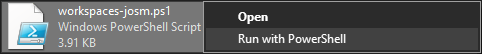
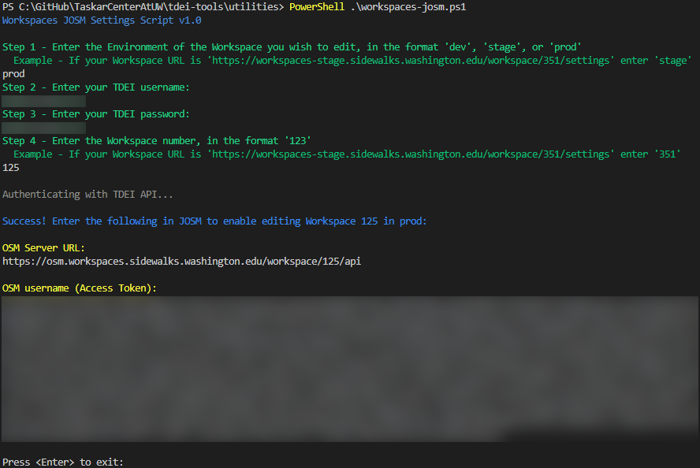
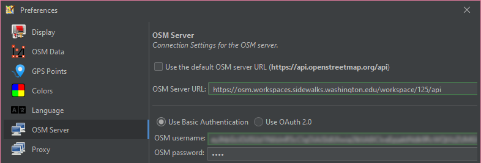

# Workspaces JOSM Settings Guide

This guide explains how use the [Workspaces JOSM Settings Script](https://github.com/TaskarCenterAtUW/tdei-tools/blob/main/utilities/workspaces-josm.ps1) from [TDEI Tools](https://github.com/TaskarCenterAtUW/tdei-tools/) to set up JOSM to enable editing of Workspaces.

_For a list of all guides on the TCAT Wiki, refer to the [Guides List](../../../../guides/index.md)._

---

## Instructions

Note: You must have a [TDEI Portal](https://portal.tdei.us/) account.

### 1. Download and run the helper script

   1. Download the [Workspaces JOSM Settings Script](https://github.com/TaskarCenterAtUW/tdei-tools/blob/main/utilities/workspaces-josm.ps1) from [TDEI Tools](https://github.com/TaskarCenterAtUW/tdei-tools/).
   2. Run the script by right clicking and selecting "Run with PowerShell"
   
   

   Now, follow the script's instructions and enter the requested information:

### 2. Determine your environment

   1. Prod: [portal.tdei.us](https://portal.tdei.us/) + [workspaces.sidewalks.washington.edu](https://workspaces.sidewalks.washington.edu/)

   2. Stage: [portal-stage.tdei.us](https://portal-stage.tdei.us/) + [workspaces-stage.sidewalks.washington.edu](https://workspaces-stage.sidewalks.washington.edu/)

   3. Dev: [portal-dev.tdei.us](https://portal-dev.tdei.us/login) + [workspaces-dev.sidewalks.washington.edu](https://workspaces-dev.sidewalks.washington.edu/)

### 3. Enter your TDEI credentials

   1. Enter the credentials for the account you use to sign into both the [TDEI Portal](https://portal.tdei.us/) and [Workspaces](https://workspaces.sidewalks.washington.edu/).

### 4. Find your Workspace ID

   1. Extract the ID from the Workspace link, in this case `125`:
   
`https://workspaces.sidewalks.washington.edu/workspace/125/settings`

### 5. Generate JOSM Settings

   1. After entering the Workspace ID, the script will authenticate you and output two strings:

### 6. Apply JOSM Settings

   1. Open JOSM's "Preferences" Menu

   
   
   2. Navigate to the "OSM Server" menu
   
   
   
   3. If present, click "Remove token"

   

   4. Uncheck _"User the default OSM server URL"_
   5. Paste in the generated URL from the script
   6. Select _"Use Basic Authentication"_
   7. Paste in the generated Access Token in the _"OSM username"_ field
   8. Enter `none` in the _"OSM password"_ field

   

   9. Save your settings changes.

You should now be able to use JOSM to edit the specified Workspace!
