<!-- @format -->

## Workspace Settings

This section explains how to use the Workspaces platform to configure Workspace Settings.

_For a list of all guides on the TCAT Wiki, refer to the [Guides List](../../guides-list/index.md)._

---

### Workspace Settings

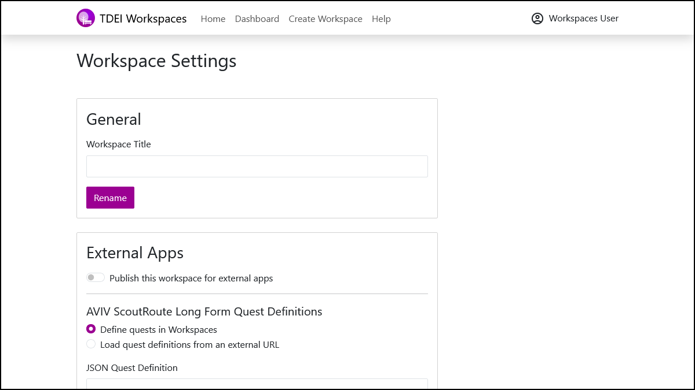{ width="400" }

#### General

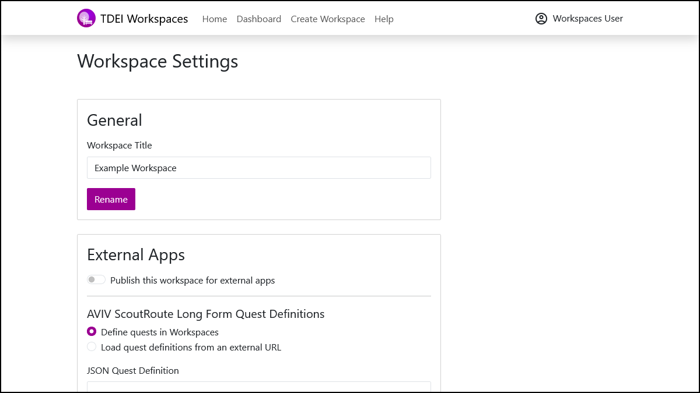{ width="400" }

- **Workspace Title**

To rename a Workspace, enter a name into the **"Workspace Title"** text entry box, then select **"Rename"**.

If successful, a toast with the message **"Workspace renamed successfully."** will appear at the top right of the page.

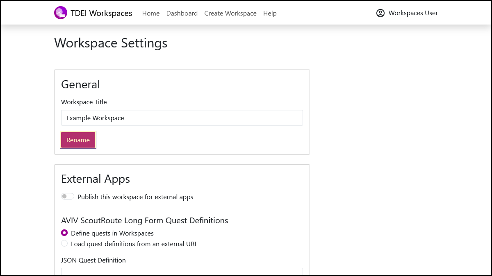{ width="400" } 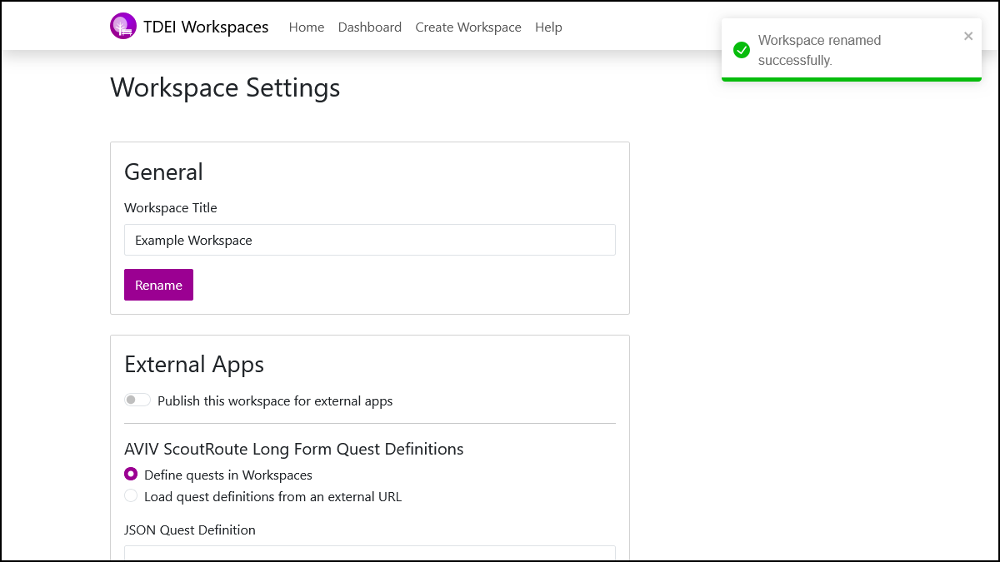{ width="400" }

#### External Apps

{ width="400" }

- **Publish**

To control the visibility of a Workspace in external apps such as [AVIV ScoutRoute](../../aviv-scoutroute/index.md), select the toggle button next to **"Publish this Workspace for external apps"** then select **"Save"**.

If successful, the message **"Changes saved."** will appear below the **"Save"** button.

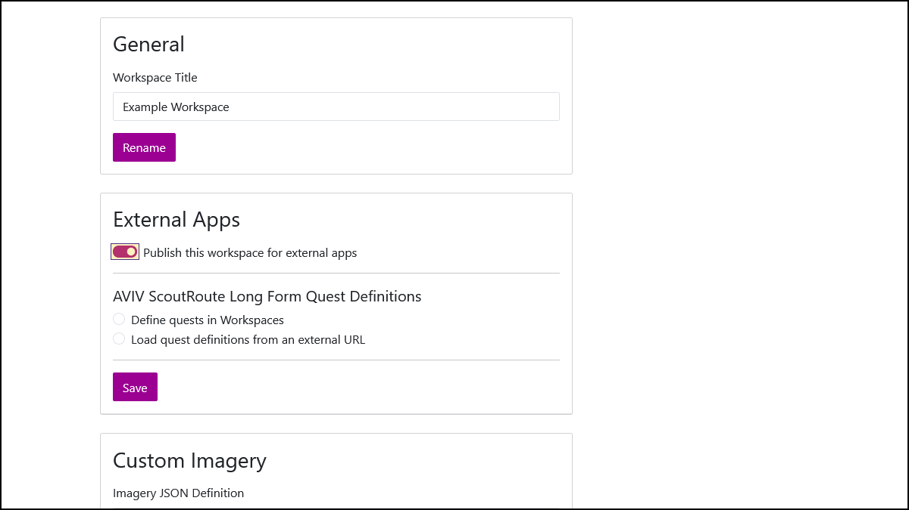{ width="400" } 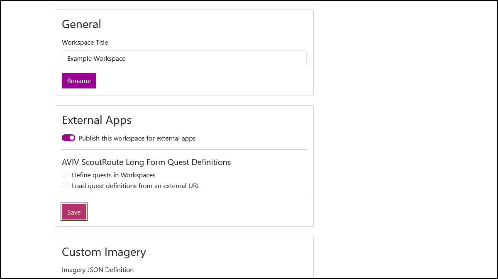{ width="400" }

- **AVIV ScoutRoute Long Form Quest Definitions**

To set the [AVIV ScoutRoute Long Form Quest Definition](../../aviv-scoutroute/quests/index.md) for a Workspace, there are two options available:

1. Define quests in Workspaces

Selecting **"Define quests in Workspaces"** expands a **"JSON Quest Definition"** text entry box in which a full AVIV ScoutRoute Long Form Quest Definition can be directly entered.

Workspaces also supports **drag-and-drop** of a JSON file into the **"JSON Quest Definition"** text entry box. If successful, a toast with the message **"JSON file loaded successfully."** will appear at the top right of the page.

Once entered using either method, be sure to select **"Save"**. If successful, the message **"Changes saved."** will appear below the **"Save"** button.

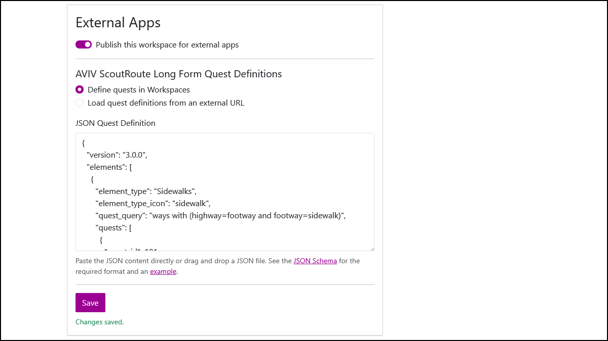{ width="400" }

1. Load quest definitions from an external URL

Selecting **"Load quest definitions from an external URL"** expands a **"Quest Definition URL"** text entry box in which a direct link to a full AVIV ScoutRoute Long Form Quest Definition can be entered.

Once entered, be sure to select **"Save"**. If successful, the message **"Changes saved."** will appear below the **"Save"** button.

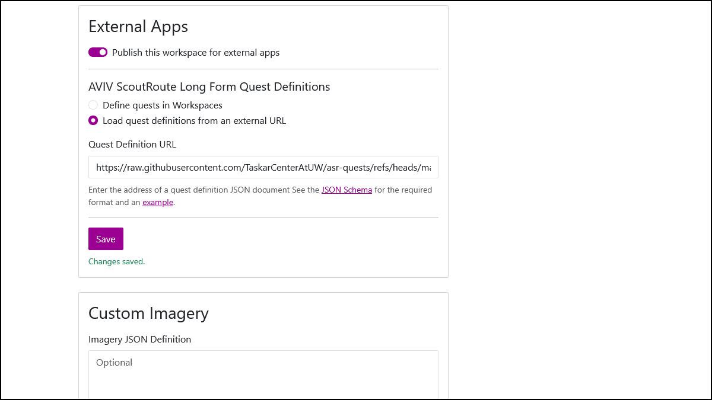{ width="400" }

Links are provided below the text box to the AVIV ScoutRoute Long Form Quest Definition [JSON Schema](https://raw.githubusercontent.com/TaskarCenterAtUW/asr-quests/refs/heads/main/schema/schema.json) and an [example](https://raw.githubusercontent.com/TaskarCenterAtUW/asr-quests/refs/heads/main/examples/example.json).

Note that when loading quest definitions from an external URL, Workspaces does not store the quest definition. Instead, the contents of the specified URL will be fetched at runtime when AVIV ScoutRoute requests the quest definition for that Workspace.

- **Custom Imagery**

To set the Custom Imagery list for a Workspace, enter a Custom Imagery Definition into the **"Imagery JSON Definition"** text entry box.

Workspaces also supports **drag-and-drop** of a JSON file into the **"Imagery JSON Definition"** text entry box. If successful, a toast with the message **"JSON file loaded successfully."** will appear at the top right of the page.

Once entered using either method, be sure to select **"Save"**. If successful, the message **"Changes saved."** will appear below the **"Save"** button.

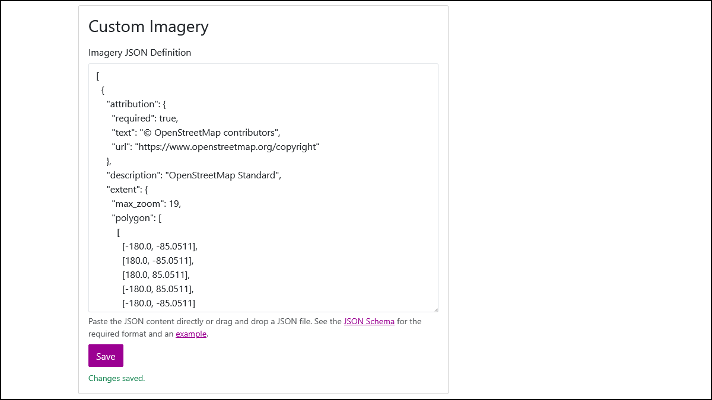{ width="400" }

Links are provided below the text box to the AVIV ScoutRoute Custom Imagery Definition [JSON Schema](https://raw.githubusercontent.com/TaskarCenterAtUW/asr-imagery-list/refs/heads/main/schema/schema.json) and an [example](https://raw.githubusercontent.com/TaskarCenterAtUW/asr-imagery-list/refs/heads/main/examples/example.json).

- **Delete Workspace**

**Caution! Deleting a Workspace is permanent and cannot be undone.**

This will not remove any TDEI datasets outside of Workspaces.

To delete a Workspace, navigate to the bottom of the Workspace Settings page and select **"I understand, and I want to delete this Workspace."**

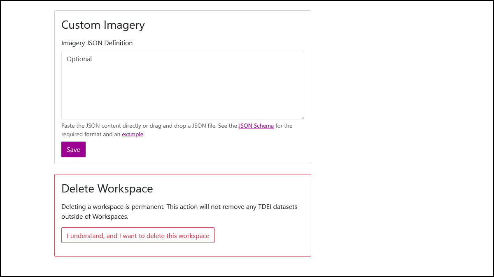{ width="400" }

Then, to confirm that you would like to delete the currently selected Workspace, type "delete" in the deletion confirmation text entry box.

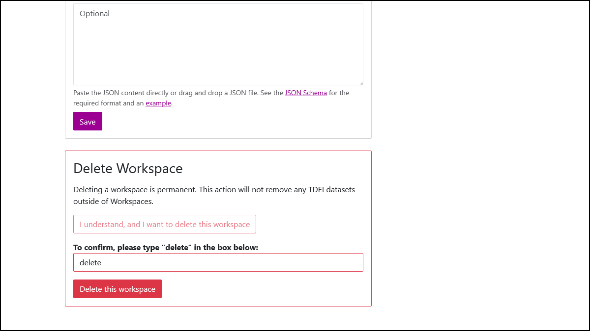{ width="400" }

Following a short delay after the "Delete this Workspace." button is selected, you will be returned to the Dashboard page.
